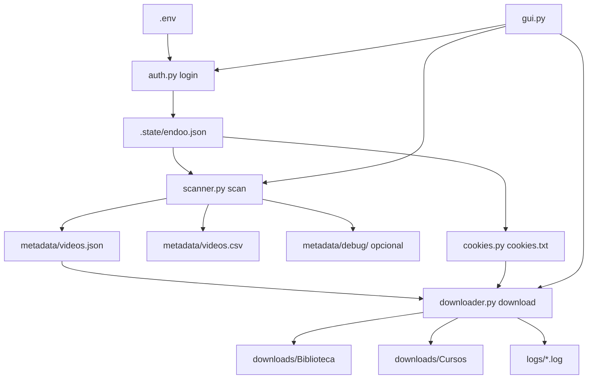

# Manual Para Outras AIs: VRSoft/Endoo Video Extractor

Este documento e um handoff tecnico detalhado para outra IA, agente de codigo ou engenheiro entender, executar, manter e melhorar o projeto `vrsoft-video-extractor`.

O objetivo do projeto e inventariar e baixar videoaulas acessiveis por uma conta autenticada no portal VRSoft/Endoo:

- Portal: `https://vrsoft.endoo.com.br`
- Biblioteca: `https://vrsoft.endoo.com.br/arquivos`
- Cursos: `https://vrsoft.endoo.com.br/cursos`

O projeto nao tenta burlar DRM, criptografia, paywall, inscricao obrigatoria, controles de acesso, CAPTCHA ou MFA. Ele usa somente a sessao autenticada da conta configurada.

## Contexto Deste Chat

Esta secao resume a conversa que originou o projeto. Ela existe para que outra IA nao precise inferir as decisoes apenas pelo codigo.

O pedido inicial foi montar um plano para extrair videos do portal:

- `https://vrsoft.endoo.com.br/login?returnTo=%2Ffrontpage`

O usuario informou que possui autenticacao valida e que os videos ficam em duas areas principais:

- Biblioteca, depois identificada como `https://vrsoft.endoo.com.br/arquivos`.
- Cursos, depois identificada como `https://vrsoft.endoo.com.br/cursos`.

Decisoes tomadas durante o chat:

- Criar um extrator local em Python, no diretorio `D:\Codex\Projetos\vrsoft-video-extractor`.
- Guardar credenciais em `.env`, nunca hardcoded no codigo.
- Usar Playwright para login, sessao autenticada, navegacao e captura de rede.
- Usar `yt-dlp` para downloads diretos, HLS e embeds suportados.
- Usar `ffmpeg` como pre-requisito para streams HLS.
- Baixar somente videos acessiveis pela conta autenticada.
- Nao fazer autoinscricao automatica em cursos na v1.
- Nao contornar DRM, criptografia, paywall ou bloqueios tecnicos.
- Organizar downloads por area, curso, modulo e aula.
- Gerar metadata em JSON e CSV.

Durante a implementacao, o usuario chegou a pedir arquivos `.bat` de start/stop, mas depois descartou essa abordagem. A decisao final foi criar uma interface grafica desktop em Tkinter que controla a CLI real.

A GUI precisa expor:

- Campos de `ENDOO_EMAIL`, `ENDOO_PASSWORD`, `base_url`, `max_pages` e `concurrency`.
- Senha mascarada.
- Botoes `Login`, `Scan`, `Diagnostico Scan`, `Download`, `Run`, `Parar Processo`, `Abrir Downloads`, `Abrir Metadata` e `Abrir Logs`.
- Painel de logs em tempo real.
- Status com processo atual, codigo de saida, ultimo log e quantidade de videos no inventario.

Problema real observado no chat:

```text
Iniciando download
... vrsoft-extractor.exe ... download --concurrency 2
ERROR vrsoft_extractor.cli: Nenhum inventario encontrado em ...\metadata\videos.json. Execute scan primeiro.
Processo finalizado com codigo 1
```

A partir desse erro, ficou claro que a GUI e a CLI deveriam:

- Exigir ou orientar a execucao de `scan` antes de `download`.
- Alertar quando `metadata/videos.json` nao existir ou estiver vazio.
- Mostrar a quantidade de videos encontrados no inventario.

Depois disso, o usuario corrigiu o alvo do scanner:

- Biblioteca nao e uma pagina generica; os videos estao em subpastas dentro de `/arquivos`.
- Cursos ficam em subpastas dentro de `/cursos`.
- Para cursos, o conteudo so deve ser acessado quando a conta ja estiver inscrita.

A revisao do scanner entao passou a exigir:

- Foco exclusivo nas arvores `/arquivos` e `/cursos`.
- Rejeicao de areas fora do escopo como `admin`, `blog`, `wiki`, `lojinha`, `dashboard`, `links` e `minha-performance`.
- Diagnostico em `metadata/debug/` para paginas/subpastas sem video detectado.
- Captura de HTML, screenshot e URLs de rede sem salvar senha, cookies ou tokens sensiveis.

O usuario forneceu credenciais reais no chat. Essas credenciais nao devem ser copiadas para este manual, README, testes, logs, metadata, screenshots ou mensagens futuras. Se uma IA precisar executar o projeto, deve usar o `.env` local ja existente ou solicitar ao usuario que configure novamente:

```dotenv
ENDOO_EMAIL=...
ENDOO_PASSWORD=...
```

No final, o usuario pediu explicitamente um manual "mais detalhado possivel" para outras AIs entenderem o projeto, melhorarem e executarem. Este arquivo e a resposta a esse pedido.

## Estado Atual Do Projeto

Diretorio esperado:

```text
D:\Codex\Projetos\vrsoft-video-extractor
```

Principais capacidades ja implementadas:

- Login autenticado com Playwright.
- Persistencia de sessao em `.state/endoo.json`.
- GUI desktop em Tkinter.
- CLI com comandos `login`, `scan`, `download` e `run`.
- Scanner focado nas arvores reais:
  - `/arquivos` para Biblioteca.
  - `/cursos` para Cursos.
- Uso das APIs reais do app para acelerar e estabilizar o scan:
  - `https://api.iendo.us/api/files/files/{folder_id}`
  - `https://api.iendo.us/api/courses/student/...`
  - `https://api.iendo.us/api/courses/{course_id}/{participant_id}`
  - `https://api.iendo.us/api/courses/task/{task_id}/participant/{participant_id}`
- Extracao de videos Habilize/SCORM por arquivos publicados em `builder-publish`.
- Fallback DOM/Playwright para paginas que nao forem cobertas pela API.
- Inventario em JSON e CSV.
- Download com `yt-dlp`.
- Conversao de storage state Playwright para cookies Netscape quando necessario.
- Diagnostico opcional em `metadata/debug/`.
- Testes unitarios para utilitarios, inventario, GUI, downloader e scanner.

Validacao real recente feita neste ambiente:

```text
Scan reduzido:
  total: 659 videos
  biblioteca: 625 videos
  curso: 34 videos
```

Esses numeros dependem da conta, inscricoes, permissoes e do valor de `--max-pages`.

## Regras Importantes Para Qualquer Agente

1. Nao registre senha em codigo, logs, screenshots, metadata, README ou respostas.
2. Nao faca autoinscricao em cursos sem pedido explicito.
3. Nao tente contornar DRM, criptografia, links protegidos sem permissao ou bloqueios de acesso.
4. Preserve `.env`, `.state/`, `downloads/`, `logs/`, `metadata/` e `.test-tmp/` fora do Git.
5. Antes de mudar scraping ou download, rode testes unitarios.
6. Antes de afirmar que o download falha, confira se `metadata/videos.json` tem itens.
7. Se o scan retornar zero, primeiro rode `scan --diagnostic` e inspecione `metadata/debug/`.
8. Se mexer na GUI, valide ao menos com `--smoke-test`.

## Estrutura De Arquivos

```text
vrsoft-video-extractor/
  .env                         Credenciais locais. Ignorado pelo Git.
  .env.example                 Modelo de configuracao.
  .gitignore                   Ignora credenciais, sessoes e saidas.
  pyproject.toml               Metadata, dependencias e entry points.
  requirements.txt             Dependencias tradicionais.
  README.md                    Uso rapido para humano.
  MANUAL_PARA_AIS.md           Este manual.
  VRSoftExtractorGUI.pyw       Atalho para duplo clique da GUI.

  vrsoft_extractor/
    __main__.py                Permite `python -m vrsoft_extractor`.
    auth.py                    Login, sessao Playwright e modo GUI.
    cli.py                     CLI principal.
    cookies.py                 Exporta cookies do storage_state.
    downloader.py              Download com yt-dlp.
    gui.py                     Interface grafica Tkinter.
    inventory.py               Leitura, merge e escrita de JSON/CSV.
    logging_utils.py           Logs com redacao de segredos.
    models.py                  Dataclass VideoItem.
    runtime.py                 Runtime Playwright local e ffmpeg.
    scanner.py                 Scan Biblioteca/Cursos.
    settings.py                Configuracao, paths e .env.
    utils.py                   Sanitizacao, classificacao e paths.

  tests/
    test_auth.py
    test_cookies.py
    test_downloader.py
    test_gui.py
    test_inventory.py
    test_runtime.py
    test_scanner.py
    test_utils.py
```

## Instalacao E Ambiente

### Requisitos

- Windows.
- Python 3.12 testado neste ambiente.
- Ambiente virtual `.venv`.
- Playwright com Chromium instalado.
- `yt-dlp`.
- `python-dotenv`.
- `ffmpeg` no PATH ou ffmpeg baixado pelo Playwright.

### Criar Ambiente Do Zero

```powershell
cd D:\Codex\Projetos\vrsoft-video-extractor
python -m venv .venv
.\.venv\Scripts\python.exe -m pip install -e .
$env:PLAYWRIGHT_BROWSERS_PATH='0'
.\.venv\Scripts\python.exe -m playwright install chromium
```

Observacao: o codigo chama `configure_playwright_runtime()` em `runtime.py`, que define `PLAYWRIGHT_BROWSERS_PATH=0` por padrao. Isso permite usar browsers locais ao pacote/venv quando instalados assim.

### Arquivo `.env`

Formato esperado:

```dotenv
ENDOO_EMAIL=usuario@example.com
ENDOO_PASSWORD=senha
ENDOO_BASE_URL=https://vrsoft.endoo.com.br
ENDOO_MAX_PAGES=200
ENDOO_CONCURRENCY=2
```

`ENDOO_BASE_URL`, `ENDOO_MAX_PAGES` e `ENDOO_CONCURRENCY` sao usados pela GUI. A CLI usa argumentos equivalentes e carrega email/senha via `.env`.

## Como Executar

### GUI

Metodo principal para usuario final:

```powershell
cd D:\Codex\Projetos\vrsoft-video-extractor
.\.venv\Scripts\vrsoft-extractor-gui.exe
```

Alternativa:

```powershell
.\.venv\Scripts\python.exe -m vrsoft_extractor.gui
```

Duplo clique:

```text
D:\Codex\Projetos\vrsoft-video-extractor\VRSoftExtractorGUI.pyw
```

Botoes da GUI:

- `Salvar .env`: grava email, senha, base URL, max paginas e concorrencia.
- `Login`: autentica e salva sessao.
- `Scan`: cria/atualiza `metadata/videos.json` e `metadata/videos.csv`.
- `Diagnostico Scan`: roda scan com artefatos em `metadata/debug/`.
- `Download`: baixa videos pendentes do inventario.
- `Run`: login + scan + download.
- `Parar Processo`: encerra somente o subprocesso iniciado pela GUI.
- `Abrir Downloads`: abre `downloads/`.
- `Abrir Metadata`: abre `metadata/`.
- `Abrir Logs`: abre `logs/`.

### CLI

```powershell
cd D:\Codex\Projetos\vrsoft-video-extractor
.\.venv\Scripts\vrsoft-extractor.exe login
.\.venv\Scripts\vrsoft-extractor.exe scan
.\.venv\Scripts\vrsoft-extractor.exe download
```

Scan com diagnostico:

```powershell
.\.venv\Scripts\vrsoft-extractor.exe scan --diagnostic
```

Fluxo completo:

```powershell
.\.venv\Scripts\vrsoft-extractor.exe run
```

Scan limitado para teste rapido:

```powershell
.\.venv\Scripts\vrsoft-extractor.exe --max-pages 2 scan
```

Download com concorrencia ajustada:

```powershell
.\.venv\Scripts\vrsoft-extractor.exe download --concurrency 2
```

## Fluxo De Dados



## Autenticacao

Arquivo principal: `vrsoft_extractor/auth.py`.

Funcoes centrais:

- `login(settings, headless=False, force=False)`
- `ensure_session(settings, headless=True)`

Comportamento:

1. Abre `base_url/frontpage`.
2. Se `.state/endoo.json` existir e ainda for valido, reaproveita sessao.
3. Se precisar login, usa `ENDOO_EMAIL` e `ENDOO_PASSWORD`.
4. Tenta preencher formulario por seletores genericos.
5. Se CAPTCHA/MFA aparecer:
   - em modo normal, espera o usuario concluir e pressionar Enter;
   - em modo GUI (`ENDOO_GUI_MODE=1`), aguarda automaticamente ate 10 minutos.
6. Salva storage state em `.state/endoo.json`.

Pontos de atencao:

- Se o portal mudar nomes de inputs, revise `EMAIL_SELECTORS`, `PASSWORD_SELECTORS`, `SUBMIT_SELECTORS`.
- Nunca logar senha.
- A GUI passa `ENDOO_GUI_MODE=1` no ambiente do subprocesso.

## Scanner

Arquivo principal: `vrsoft_extractor/scanner.py`.

Entrada publica:

```python
scan(settings, headless=True, diagnostic=False)
```

### Secoes

`SECTION_SPECS` define as raizes:

```python
SectionSpec(area="biblioteca", label="Biblioteca", root_path="/arquivos")
SectionSpec(area="curso", label="Cursos", root_path="/cursos")
```

### Caminho Preferencial: APIs

O scanner primeiro tenta API, porque o DOM do portal e uma SPA Angular e muitos itens nao aparecem como `<a href>`.

#### Captura De Headers

`MediaRecorder.request_handler()` captura headers das chamadas `https://api.iendo.us/api/...`:

- `authorization`
- `site-domain`
- `site-hashid`
- `x-site-id`
- `x-user-id`
- `accept`
- `content-type`
- `referer`
- `user-agent`

Esses headers sao necessarios porque chamadas diretas sem `Authorization` retornam `401`.

#### Biblioteca

Funcao:

```python
_crawl_files_api(page, recorder, settings)
```

Endpoint:

```text
https://api.iendo.us/api/files/files/{folder_id}
```

Raiz:

```text
folder_id = 0
```

Comportamento:

1. Usa fila BFS: `(folder_id, path_parts)`.
2. Visita pastas ate `settings.max_pages_per_section`.
3. Se `item.type == "folder"`, adiciona na fila.
4. Se for arquivo, chama `_media_urls_from_file_item(item)`.
5. Considera video se:
   - `file.content_type` comeca com `video`, ou
   - URL classifica como `mp4` ou `hls`.

Campos reais observados em arquivo de video:

```json
{
  "id": 241648,
  "name": "4. Novo campo da Reforma Tributaria no Tipo Saida da NFe.mp4",
  "type": "file",
  "file": {
    "content_type": "video/mp4",
    "path": "https://iendo.b-cdn.net/uploads/public/...mp4",
    "file_size": 39285800
  }
}
```

#### Cursos

Funcao:

```python
_crawl_courses_api(page, recorder, settings)
```

Endpoint de lista:

```text
https://api.iendo.us/api/courses/student/?items=&filter=all&status=all&category_id=all&class_status=all&shelf=0&include_training_courses=0&order=created_at&position=0&limit=8&page={page_index}&required=0
```

Regra de inscricao:

- Curso inscrito: `course["participant"]` existe e tem `id`.
- Curso nao inscrito: `participant` e `null`; o scanner ignora.

Endpoint de detalhe:

```text
https://api.iendo.us/api/courses/{course_id}/{participant_id}
```

Endpoint de tarefa/aula:

```text
https://api.iendo.us/api/courses/task/{task_id}/participant/{participant_id}
```

Fluxo:

1. Lista paginas de cursos.
2. Ignora cursos sem `participant.id`.
3. Carrega detalhe do curso.
4. Percorre `chapters[*].tasks[*]`.
5. Para cada task habilitada, carrega detalhe.
6. Procura URLs de video no payload inteiro.
7. Se a task tiver `habilize`, extrai videos do pacote Habilize.
8. Se a extracao estatica falhar, abre a rota autenticada Habilize como fallback.

Campos reais observados:

```json
{
  "id": 79280,
  "name": "Como realizar o cadastro de ofertas",
  "type": "habilize",
  "habilize": "/uploads/builder-publish/.../index.html"
}
```

### Habilize / SCORM

O conteudo Habilize pode nao expor MP4 direto no payload da API. O projeto trata assim:

1. `_media_urls_from_habilize()` monta URLs candidatas:
   - `https://storage.fiqueligadonews.com.br{habilize_path}`
   - `https://iendo.b-cdn.net{habilize_path}`
   - `{base_url}{habilize_path}`
2. Baixa `index.html`.
3. Procura links `#1.html`, `#2.html`, etc.
4. Baixa `pages/{n}.html`.
5. Extrai `.mp4`, `.m3u8`, `.webm`, `.m4v`.
6. Se isso falhar, `_media_urls_from_habilize_route()` abre:

```text
{base_url}/cursos/curso/habilize/{course_id}/{task_id}/{participant_id}
```

e captura recursos carregados pelo navegador.

### Fallback DOM

Se a API nao retornar itens, o scanner usa `_crawl_section()`:

- Segue apenas URLs dentro da arvore da secao.
- Rejeita rotas como `/admin`, `/blog`, `/wiki`, `/dashboard`, `/lojinha`.
- Tenta clicar controles seguros como `Assistir`, `Continuar`, `Acessar aula`.
- Nao clica inscricao, compra, matricula ou pagamento.

### Diagnostico

Com `scan --diagnostic`, paginas sem video geram:

```text
metadata/debug/{area}_{hash}.html
metadata/debug/{area}_{hash}.png
metadata/debug/{area}_{hash}.urls.txt
```

Sanitizacao:

- Remove valores de `ENDOO_EMAIL` e `ENDOO_PASSWORD`.
- Mascara JWTs.
- Mascara query params sensiveis como `token`, `signature`, `key`, `secret`, `auth`.

## Inventario

Arquivo principal: `vrsoft_extractor/inventory.py`.

Arquivos gerados:

```text
metadata/videos.json
metadata/videos.csv
```

Modelo: `vrsoft_extractor/models.py`

```python
VideoItem(
    area="biblioteca" | "curso",
    page_url="...",
    media_url="...",
    media_type="mp4" | "hls" | "embed" | "unknown",
    lesson_title="...",
    course="...",
    module="...",
    status="found" | "downloaded" | "skipped" | "failed" | "protected",
    local_path="...",
    error="...",
    discovered_at="...",
    id="..."
)
```

Deduplicacao:

- Chave principal: `media_url`.
- Se o mesmo video reaparece em scans futuros, `merge_inventory()` preserva status `downloaded`/`skipped` e caminho local.

CSV:

Campos em `CSV_FIELDS`:

```text
id, area, course, module, lesson_title, page_url, media_url, media_type, status, local_path, error, discovered_at
```

## Download

Arquivo principal: `vrsoft_extractor/downloader.py`.

Entrada publica:

```python
download_inventory(settings, concurrency=2, redownload=False)
```

Fluxo:

1. Carrega `metadata/videos.json`.
2. Se o arquivo nao existe, erro orientando rodar scan.
3. Se existe mas esta vazio, erro orientando rodar Scan ou Diagnostico Scan.
4. Exporta cookies de `.state/endoo.json` para `.state/cookies.txt`.
5. Filtra itens com `media_url` e status diferente de `downloaded`/`protected`.
6. Executa downloads paralelos com `ThreadPoolExecutor`.
7. Usa `yt-dlp`.
8. Define `Referer` como `item.page_url`.
9. Usa `ffmpeg_location` se `runtime.find_ffmpeg()` encontrar ffmpeg.
10. Atualiza inventario com status e caminho local.

Organizacao de arquivos:

```text
downloads/
  Biblioteca/
    {course}/
      {module}/
        {lesson_title}.mp4
  Cursos/
    {course}/
      {module}/
        {lesson_title}.mp4
```

Retomada:

- Se arquivo de destino ja existe, status vira `skipped`.
- Se `--redownload` for usado, baixa novamente.

Tratamento de falhas:

- Erros com termos `drm`, `encrypted`, `403`, `401`, etc. viram status `protected`.
- Outros erros viram status `failed`.
- Falha em um item nao interrompe o lote inteiro.

## GUI

Arquivo principal: `vrsoft_extractor/gui.py`.

Entry point:

```text
vrsoft-extractor-gui = vrsoft_extractor.gui:main
```

Atalho:

```text
VRSoftExtractorGUI.pyw
```

Design:

- Tkinter puro.
- Executa a CLI real em subprocesso.
- Nao chama funcoes internas diretamente.
- Mantem um processo por vez.
- Redige email e senha nos logs da tela.
- Atualiza contagem do inventario lendo `metadata/videos.json`.

Comandos montados por `build_cli_command()`:

- `login`
- `scan`
- `scan --diagnostic`
- `download --concurrency N`
- `run --concurrency N`

Detalhes importantes:

- Prefere `.venv\Scripts\vrsoft-extractor.exe`.
- Fallback: `sys.executable -m vrsoft_extractor`.
- Seta `ENDOO_GUI_MODE=1` para login sem prompt de terminal.
- No Windows, `Parar Processo` usa `taskkill /PID ... /T /F`.
- `Download` e bloqueado se o inventario estiver ausente ou vazio.

Validar GUI sem deixar janela aberta:

```powershell
.\.venv\Scripts\python.exe -B -m vrsoft_extractor.gui --project-dir . --smoke-test
.\.venv\Scripts\vrsoft-extractor-gui.exe --project-dir . --smoke-test
```

## CLI

Arquivo principal: `vrsoft_extractor/cli.py`.

Entry point:

```text
vrsoft-extractor = vrsoft_extractor.cli:main
```

Argumentos globais:

```text
--project-dir
--base-url
--max-pages
```

Comandos:

```text
login
  --headless
  --force

scan
  --headed
  --diagnostic

download
  --concurrency
  --redownload

run
  --login-headless
  --headed-scan
  --diagnostic-scan
  --concurrency
  --redownload
```

## Runtime

Arquivo: `vrsoft_extractor/runtime.py`.

Funcoes:

- `configure_playwright_runtime()`
- `find_ffmpeg()`

`configure_playwright_runtime()`:

- Define `PLAYWRIGHT_BROWSERS_PATH=0` se ainda nao estiver definido.

`find_ffmpeg()`:

1. Procura `ffmpeg` no PATH.
2. Procura ffmpeg baixado pelo Playwright em:

```text
.venv\Lib\site-packages\playwright\driver\package\.local-browsers\ffmpeg-*\ffmpeg-win64.exe
```

## Logs

Arquivo: `vrsoft_extractor/logging_utils.py`.

Cada comando cria:

```text
logs/{command}-{YYYYMMDD-HHMMSS}.log
```

Exemplos:

```text
logs/login-20260627-100631.log
logs/scan-20260627-110422.log
logs/download-20260627-102730.log
```

Redacao:

- `RedactingFilter` remove segredos conhecidos por `settings.sensitive_values()`.
- Segredos atualmente: `ENDOO_EMAIL`, `ENDOO_PASSWORD`.

## Testes

Rodar todos:

```powershell
cd D:\Codex\Projetos\vrsoft-video-extractor
.\.venv\Scripts\python.exe -B -m unittest discover -s tests -v
```

Checagem de sintaxe por AST:

```powershell
.\.venv\Scripts\python.exe -B -c "import ast, pathlib; [ast.parse(p.read_text(encoding='utf-8'), filename=str(p)) for p in list(pathlib.Path('vrsoft_extractor').glob('*.py')) + list(pathlib.Path('tests').glob('*.py'))]; print('AST parse OK')"
```

Smoke test da GUI:

```powershell
.\.venv\Scripts\python.exe -B -m vrsoft_extractor.gui --project-dir . --smoke-test
.\.venv\Scripts\vrsoft-extractor-gui.exe --project-dir . --smoke-test
```

Coberturas relevantes:

- `test_scanner.py`: filtros de links, Habilize, extracao de midia e sanitizacao.
- `test_downloader.py`: inventario vazio.
- `test_gui.py`: montagem de comandos, `.env`, contagem de inventario.
- `test_inventory.py`: merge e persistencia.
- `test_utils.py`: nomes Windows, classificacao de media e paths.

## Comandos De Validacao Manual

### Ver Quantidade Atual Do Inventario

```powershell
.\.venv\Scripts\python.exe -B -c "import json, collections; data=json.load(open('metadata/videos.json', encoding='utf-8')); print('total', len(data)); print(dict(collections.Counter(item.get('area') for item in data)))"
```

### Ver Primeiros Itens

```powershell
.\.venv\Scripts\python.exe -B -c "import json; data=json.load(open('metadata/videos.json', encoding='utf-8')); [print(i['area'], i['lesson_title'], i['media_type'], i['media_url'][:100]) for i in data[:10]]"
```

### Scan Rapido

```powershell
.\.venv\Scripts\vrsoft-extractor.exe --max-pages 2 scan
```

### Scan Completo

```powershell
.\.venv\Scripts\vrsoft-extractor.exe --max-pages 200 scan
```

### Download

```powershell
.\.venv\Scripts\vrsoft-extractor.exe download --concurrency 2
```

## Troubleshooting

### Download Diz Que Inventario Esta Vazio

Sintoma:

```text
Inventario vazio em metadata/videos.json. Execute Scan ou Diagnostico Scan primeiro.
```

Acao:

1. Rode `scan`.
2. Confira `metadata/videos.json`.
3. Se continuar vazio, rode `scan --diagnostic`.
4. Inspecione `metadata/debug/*.urls.txt` para ver endpoints e recursos.

### Scan Nao Acha Cursos

Possiveis causas:

- Conta nao inscrita nos cursos.
- `participant` vem `null` na API.
- Curso tem conteudo nao Habilize ou sem video direto.
- Mudanca de endpoint do Endoo.

Acao:

1. Rodar `scan --diagnostic`.
2. Conferir log por mensagens:

```text
[Cursos] Ignorando curso sem inscricao ativa
[Cursos] Cursos inscritos processados
[Cursos] Videos API encontrados
```

3. Se cursos inscritos foram processados mas `Videos API encontrados: 0`, investigar payload de:

```text
api/courses/{course_id}/{participant_id}
api/courses/task/{task_id}/participant/{participant_id}
```

### API Retorna 401

Causa comum:

- Headers de API nao capturados.
- Sessao expirada.
- `.state/endoo.json` invalido.

Acao:

```powershell
.\.venv\Scripts\vrsoft-extractor.exe login --force
.\.venv\Scripts\vrsoft-extractor.exe scan
```

### Playwright Nao Inicia

Acao:

```powershell
$env:PLAYWRIGHT_BROWSERS_PATH='0'
.\.venv\Scripts\python.exe -m playwright install chromium
```

Validacao:

```powershell
.\.venv\Scripts\python.exe -B -c "from vrsoft_extractor.runtime import configure_playwright_runtime; configure_playwright_runtime(); from playwright.sync_api import sync_playwright; p=sync_playwright().start(); b=p.chromium.launch(headless=True); print('Chromium OK', b.version); b.close(); p.stop()"
```

### GUI Abre Mas Download Nao Roda

Possiveis causas:

- Inventario vazio ou ausente.
- GUI bloqueou download corretamente.
- Scan ainda nao foi executado.

Acao:

1. Clique `Scan`.
2. Aguarde finalizar.
3. Confira rodape: `Inventario: N video(s)`.
4. Clique `Download`.

### Alguns Videos Falham Com 403/401

Possiveis causas:

- URL protegida expirada.
- Requer headers adicionais.
- Requer cookies da sessao.
- Acesso real nao permitido.

Acao:

1. Rodar `login --force`.
2. Rodar `scan` novamente.
3. Rodar `download --redownload` apenas se necessario.
4. Nao tentar burlar restricao.

### Download De HLS Falha

Possivel causa:

- `ffmpeg` ausente.

Acao:

```powershell
.\.venv\Scripts\python.exe -m playwright install chromium
```

Ou instalar ffmpeg no PATH.

## Pontos Fracos Conhecidos

1. `max_pages` tem dois significados:
   - Biblioteca: numero maximo de pastas visitadas.
   - Cursos: numero maximo de paginas de cursos na API.
2. Curso Habilize pode exigir fallback de navegador se o MP4 nao aparecer nos arquivos `pages/*.html`.
3. O scan completo de cursos pode demorar se houver muitos cursos inscritos e muitas aulas.
4. Alguns textos acentuados no codigo podem aparecer corrompidos em ambientes com encoding diferente; isso nao afeta a logica principal, mas merece limpeza futura.
5. `_open_section()` ainda existe por compatibilidade/fallback historico, mas o scanner atual usa raizes fixas e API primeiro.
6. O downloader usa `yt-dlp`; para MP4 direto poderia haver um downloader HTTP mais simples, mas `yt-dlp` e mais robusto para HLS/embeds.
7. A GUI executa subprocessos da CLI; ela nao tem callbacks de progresso por item.

## Melhorias Recomendadas

### Alta Prioridade

- Adicionar progresso de scan por area na GUI.
- Adicionar progresso de download por item.
- Criar opcao "Somente Biblioteca", "Somente Cursos" e "Ambos".
- Separar `max_file_folders` e `max_course_pages`.
- Melhorar logs de cursos mostrando `course_id`, `participant_id` e quantidade de tasks.
- Adicionar cache de payloads API para diagnostico controlado.

### Media Prioridade

- Baixar thumbnails/metadados enriquecidos.
- Permitir filtro por pasta, curso ou palavra-chave.
- Permitir exportar relatorio HTML.
- Detectar arquivos ja baixados por hash/tamanho, nao apenas nome.
- Adicionar retry especifico para API 429/5xx.
- Validar tamanho final baixado contra `file_size` quando disponivel.

### Baixa Prioridade

- Empacotar GUI como `.exe` com PyInstaller.
- Adicionar tema visual melhor para Tkinter ou migrar para CustomTkinter.
- Criar dashboard local com estatisticas.
- Adicionar suporte opcional a banco SQLite para historico.

## Como Adicionar Um Novo Tipo De Player

1. Identifique onde a URL aparece:
   - payload API;
   - HTML;
   - JS;
   - iframe;
   - performance/resource;
   - chamada de rede.
2. Atualize `utils.classify_media_url()` se for um novo dominio/embed.
3. Atualize `_media_urls_from_any()` ou `_extract_media_urls_from_html()` se for novo formato textual.
4. Adicione teste em `tests/test_scanner.py` ou `tests/test_utils.py`.
5. Rode testes.
6. Rode scan reduzido.

## Como Adicionar Nova Area Do Portal

1. Criar novo `SectionSpec`.
2. Definir `area`, `label`, `root_path`.
3. Implementar crawler API especifico em `_crawl_api_section()`.
4. Garantir que `VideoItem.area` tenha valor novo ou mapear para existentes.
5. Atualizar `output_base_path()` em `utils.py` se precisar nova pasta.
6. Atualizar testes.
7. Atualizar README e este manual.

## Como Investigar Mudanca No Portal

Use Playwright com sessao salva para observar endpoints:

```powershell
.\.venv\Scripts\python.exe -B -c "from playwright.sync_api import sync_playwright; from vrsoft_extractor.runtime import configure_playwright_runtime; configure_playwright_runtime(); p=sync_playwright().start(); b=p.chromium.launch(headless=False); c=b.new_context(storage_state='.state/endoo.json'); page=c.new_page(); page.goto('https://vrsoft.endoo.com.br/cursos'); page.wait_for_timeout(30000); b.close(); p.stop()"
```

Para scripts investigativos, evite imprimir:

- `authorization`
- `access_token`
- cookies
- `.state/endoo.json`
- senha

Se precisar imprimir headers, mascare:

```python
if key == "authorization":
    value = value[:24] + "..."
```

## Checklist Antes De Entregar Mudanca

```powershell
.\.venv\Scripts\python.exe -B -m unittest discover -s tests -v
.\.venv\Scripts\python.exe -B -c "import ast, pathlib; [ast.parse(p.read_text(encoding='utf-8'), filename=str(p)) for p in list(pathlib.Path('vrsoft_extractor').glob('*.py')) + list(pathlib.Path('tests').glob('*.py'))]; print('AST parse OK')"
.\.venv\Scripts\python.exe -B -m vrsoft_extractor.gui --project-dir . --smoke-test
.\.venv\Scripts\vrsoft-extractor-gui.exe --project-dir . --smoke-test
```

Se a mudanca afetar scan:

```powershell
.\.venv\Scripts\vrsoft-extractor.exe --max-pages 2 scan
```

Se a mudanca afetar download:

```powershell
.\.venv\Scripts\vrsoft-extractor.exe download --concurrency 1
```

Use `--concurrency 1` em validacoes para reduzir efeitos colaterais e facilitar leitura de logs.

## Arquivos Que Nunca Devem Ser Enviados

```text
.env
.state/
downloads/
logs/
metadata/
.test-tmp/
cookies.txt
```

Esses caminhos podem conter credenciais, sessao, URLs temporarias, videos baixados ou diagnosticos sensiveis.

## Resumo Executivo Para Uma IA Que Vai Continuar

1. Leia `README.md`, `MANUAL_PARA_AIS.md`, `scanner.py`, `downloader.py`, `gui.py`.
2. Nao mexa em credenciais.
3. Rode testes antes e depois.
4. O scanner principal agora e API-first.
5. Biblioteca vem de `api/files/files/{folder_id}`.
6. Cursos so baixam quando `participant.id` existe.
7. Habilize geralmente revela MP4 em `builder-publish/.../pages/{n}.html`.
8. Se Habilize estatico falhar, a rota autenticada pode capturar media via Playwright.
9. GUI e um wrapper de subprocesso da CLI.
10. Download depende de `metadata/videos.json`; sem inventario, nao ha nada para baixar.
